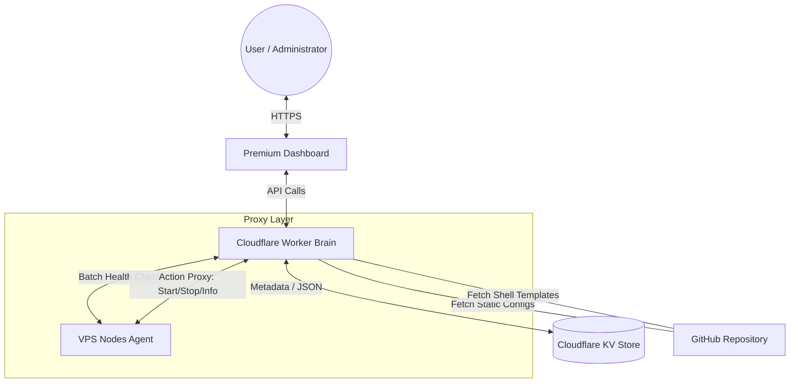

# VPS METAlink - Advanced Management System

VPS METAlink is a high-performance orchestration and monitoring system for VPS clusters, built on **Cloudflare Workers** and **KV Storage**. It provides a centralized, premium interface to manage node configurations, shell templates, and real-time health monitoring.

---

## 🏗️ System Architecture



---

## ✨ Key Features

### 1. Intelligent Monitoring
- **Live Status Dots**: Immediate visual feedback for node availability (Online/Offline).
- **Batch Optimization**: Status checks are performed cluster-wide in a single request, minimizing Cloudflare Worker quota consumption.
- **Smart Auto-Refresh**: Includes an "Auto-Live" mode that updates every 30 seconds. It intelligently **pauses** if the browser tab is hidden to save resources.

### 2. Hierarchical Configuration Management
Configurations are merged dynamically based on priority:
1.  **Global Level**: Standard settings for all nodes (`global.json`).
2.  **Group Level**: Specific settings for a cluster (e.g., `ubuntu` or `windows`).
3.  **Node Level**: Overrides for individual hostnames.
4.  **KV Overrides**: Real-time JSON overrides stored in Cloudflare KV via the Dashboard.

### 3. Management Actions
- **Proxy Actions**: Start, Shutdown, Destroy, and Reboot nodes directly from the UI.
- **Node Info**: Inspect real-time hardware metrics (CPU, RAM, OS) in a pretty-printed, easy-to-read JSON format.
- **Shell Templates**: Centralized management of setup scripts with dynamic placeholder replacement (`{{KEY}}`).

### 4. Admin Dashboard (Full CRUD)
- **Glassmorphism UI**: A premium, modern interface with dark mode and smooth animations.
- **Config Editor**: Direct JSON editing within the browser for any key.
- **Deletion Support**: Full capability to delete groups, nodes, or templates from the database with confirmation prompts.
- **Mobile Responsive**: Fully optimized for tablets and smartphones.

---

## 🛠️ Technical Stack
- **Backend**: Cloudflare Workers (TypeScript)
- **Storage**: Cloudflare KV (Key-Value)
- **Database Layer**: GitHub (for static assets)
- **Frontend**: Vanilla JavaScript / CSS (Custom Design System)
- **Auth**: Secure Token-based access Control.

## 🚀 Deployment
Ensure you have `wrangler` installed, then run:

```bash
# Preview locally
npx wrangler dev

# Deploy to Cloudflare
npx wrangler deploy
```

---

## 🔒 Security
- **Token Authorization**: All API endpoints and the Dashboard require a specific `token` parameter.
- **CORS Restricted**: API endpoints are guarded to allow only authorized traffic.
- **No-Cache Policy**: Critical status APIs use multi-layer cache-busting for 100% accuracy.
